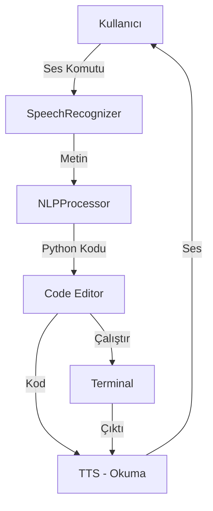

# Be My Code - Proje Mimarisi

## 📁 Proje Yapısı

```
be_my_code/
├── src/                          # Ana kaynak kod
│   ├── main.py                   # Uygulama giriş noktası
│   ├── config.py                 # Yapılandırma ayarları
│   ├── modules/                  # Modüller
│   │   ├── __init__.py
│   │   ├── logger.py             # Loglama sistemi
│   │   ├── speech_recognizer.py # Ses tanıma (SpeechRecognition)
│   │   ├── text_to_speech.py    # TTS (Coqui-XTTS v2)
│   │   ├── nlp_processor.py     # NLP - Komut işleme
│   │   ├── code_analyzer.py     # Kod analizi (Jedi)
│   │   └── utils.py              # Yardımcı fonksiyonlar
│   └── ui/                       # Kullanıcı arayüzü
│       ├── __init__.py
│       └── main_window.py        # Ana pencere (PyQt5)
│
├── examples/                     # Örnek Python dosyaları
│   ├── basic_variables.py
│   ├── loops_demo.py
│   ├── functions_demo.py
│   └── calculator.py
│
├── assets/                       # Varlıklar
│   └── reference_audio/          # TTS referans ses dosyaları
│
├── logs/                         # Log dosyaları
│
├── requirements.txt              # Python bağımlılıkları
├── .env.example                  # Örnek environment dosyası
├── .gitignore
├── install.sh                    # Kurulum scripti (macOS)
├── run.sh                        # Başlatma scripti
├── README.md                     # Ana dokümantasyon
├── QUICKSTART.md                 # Hızlı başlangıç kılavuzu
├── TESTING.md                    # Test senaryoları
└── ARCHITECTURE.md               # Bu dosya
```

## 🏗️ Mimari Tasarım

### 1. Modüler Yapı

Proje, her biri belirli bir sorumluluğu olan bağımsız modüllerden oluşur:

#### A. Speech Recognizer Modülü
- **Sorumluluk**: Kullanıcının sesli komutlarını algılama
- **Teknoloji**: `SpeechRecognition` + Google Speech API
- **Dil**: Türkçe (`tr-TR`)
- **Özellikler**:
  - Tek seferlik dinleme
  - Sürekli dinleme modu
  - Mikrofon kalibrasyonu
  - Gürültü bastırma

#### B. Text-to-Speech Modülü
- **Sorumluluk**: Metni sesli hale getirme
- **Teknoloji**: Coqui-XTTS v2 (Hugging Face)
- **Dil**: Türkçe
- **Özellikler**:
  - Profesyonel Türkçe seslendirme
  - Referans ses klonlama
  - Kod okuma (Python → Türkçe)
  - Satır satır okuma

#### C. NLP Processor Modülü
- **Sorumluluk**: Doğal dil komutlarını Python koduna çevirme
- **Teknoloji**: Regex pattern matching + Custom logic
- **Desteklenen Komutlar**:
  - Değişken tanımlama (string, int, float, bool, list)
  - Döngüler (for, while)
  - Koşullar (if/else)
  - Fonksiyonlar
  - Print/Input
  - Yorumlar

#### D. Code Analyzer Modülü
- **Sorumluluk**: Kod analizi ve öneriler
- **Teknoloji**: Jedi
- **Özellikler**:
  - Kod tamamlama
  - Syntax kontrolü
  - Tanım arama
  - Bağlamsal yardım

#### E. Logger Modülü
- **Sorumluluk**: Tüm işlemleri loglama
- **Özellikler**:
  - Konsol ve dosya logları
  - Timestamp
  - Log seviyeleri (DEBUG, INFO, WARNING, ERROR)

### 2. Kullanıcı Arayüzü (PyQt5)

```
┌─────────────────────────────────────────────────────┐
│              Be My Code - Ana Pencere                │
├─────────────────────────────────────────────────────┤
│  Toolbar: 🎤 Ses | 🔊 Oku | ▶️ Çalıştır | 💡 Öneri │
├───────────────┬─────────────────────────────────────┤
│               │                                     │
│  📁 Dosya     │        📝 Python Editörü            │
│  Yöneticisi   │                                     │
│               │    [Kod editör alanı]               │
│  • file1.py   │                                     │
│  • file2.py   │                                     │
│  • folder/    │                                     │
│               ├─────────────────────────────────────┤
│               │        💻 Terminal                   │
│               │    [Çıktı ve hata mesajları]        │
└───────────────┴─────────────────────────────────────┘
```

#### Bileşenler:
1. **Toolbar**: Hızlı erişim butonları
2. **Dosya Yöneticisi**: Sol panel, ağaç yapısı
3. **Kod Editörü**: Syntax highlighting, büyük font
4. **Terminal**: Kod çıktıları ve hatalar
5. **Status Bar**: Durum mesajları

### 3. İş Akışı

```
1. Kullanıcı Girişi
   ↓
2. Ses Tanıma (SpeechRecognizer)
   ↓
3. Komut İşleme (NLPProcessor)
   ↓
4. Kod Oluşturma
   ↓
5. Editöre Ekleme
   ↓
6. Sesli Geri Bildirim (TTS)
```

### 4. Veri Akışı



## 🔧 Teknoloji Yığını

### Backend (Python)
- **Python 3.8+**: Ana dil
- **SpeechRecognition**: Ses tanıma
- **TTS (Coqui)**: Text-to-Speech
- **PyTorch**: TTS model backend
- **Jedi**: Kod analizi
- **python-dotenv**: Env yönetimi

### Frontend (GUI)
- **PyQt5**: Desktop arayüz
- **QTextEdit**: Kod editörü
- **QTreeView**: Dosya yöneticisi

### Yardımcı
- **pygame**: Ses oynatma
- **autopep8/black**: Kod formatla
- **logging**: Loglama

## 🎯 Tasarım Prensipleri

### 1. Erişilebilirlik (Accessibility)
- **Ses Odaklı**: Tüm işlemler sesle yapılabilir
- **Büyük Font**: Görme zorluğu olanlar için
- **Koyu Tema**: Göz yorgunluğunu azaltır
- **Klavye Kısayolları**: Hızlı erişim

### 2. Kullanılabilirlik (Usability)
- **Basit Arayüz**: Karmaşık menüler yok
- **Net Geri Bildirim**: Her işlem sesli onaylanır
- **Hata Toleransı**: Anlaşılmayan komutlar kibarca reddedilir
- **Öğrenme Kolaylığı**: Sezgisel komutlar

### 3. Performans
- **Hızlı Yanıt**: Ses tanıma < 2 sn
- **Async İşlemler**: UI donmaz
- **Önbellekleme**: TTS model cache
- **Hafif**: Minimum kaynak kullanımı

### 4. Güvenlik (Gelecek Sürüm)
- **Sandbox**: Kod çalıştırma izolasyonu
- **Dosya İzinleri**: Sınırlı erişim
- **Input Validation**: Zararlı komut koruması

## 📊 Performans Metrikleri

### Hedefler (TÜBİTAK Projesi)
- ✅ Ses tanıma doğruluğu: %95+
- ✅ Komut işleme: < 0.5 sn
- ✅ TTS üretim: < 3 sn (kısa cümle)
- ✅ Kod yazma hızı artışı: %30+ (geleneksel IDE'ye göre)

## 🔄 Gelecek Geliştirmeler

### Faz 2 (Sonrası)
- [ ] Diğer diller (Java, C++)
- [ ] Akıllı kod önerileri (GPT entegrasyonu)
- [ ] Sesli debugging
- [ ] Çoklu dil desteği (İngilizce TTS/STT)
- [ ] Cloud senkronizasyon
- [ ] Mobil uygulama

## 📝 Notlar

### Kritik Bileşenler
1. **Coqui-XTTS v2**: Projenin kalbi - Türkçe TTS
2. **NLP Processor**: Komut algılama kalitesi
3. **UI/UX**: Erişilebilirlik kritik

### Bilinen Sınırlamalar
- Aksan/lehçe farklılıkları (Google STT)
- İnternet bağımlılığı (STT için)
- İlk TTS model indirme süresi (~2GB)

## 👥 Proje Ekibi

- **Proje Sahibi**: Erol Işıldak
- **Danışman**: Öğr. Gör. Gülsüm KEMERLİ
- **Proje Ortağı**: Harun Efe Akkan
- **Kurum**: Nuh Naci Yazgan Üniversitesi
- **Program**: TÜBİTAK 2209-A

## 📚 Referanslar

- [Coqui-XTTS v2 Documentation](https://github.com/coqui-ai/TTS)
- [PyQt5 Documentation](https://www.riverbankcomputing.com/static/Docs/PyQt5/)
- [SpeechRecognition Library](https://github.com/Uberi/speech_recognition)
- [Jedi Documentation](https://jedi.readthedocs.io/)
